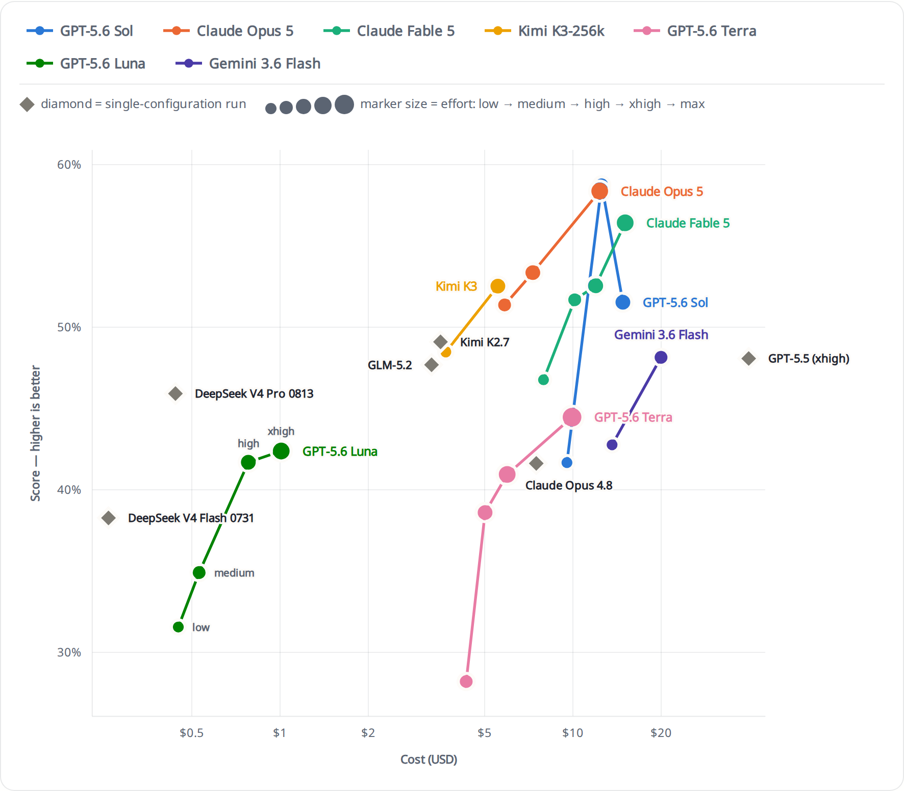
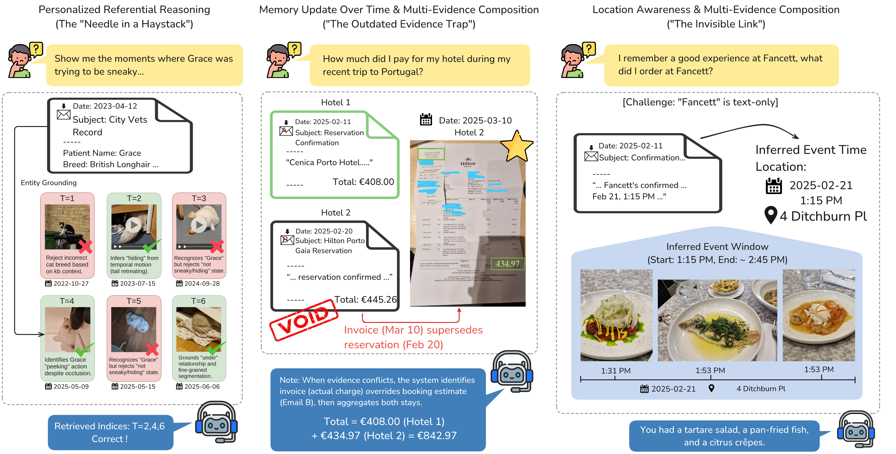

<div align="center">

# ATM-Bench: Long-Term Personalized Referential Memory QA

**The first benchmark for multimodal, multi-source personalized referential memory QA over long time horizons (~4 years), with evidence-grounded retrieval and answering.**

[🇬🇧 English](README.md) • [🇨🇳 中文](README_zh.md)

[](https://arxiv.org/abs/2603.01990)
[](https://atmbench.github.io/)
[](https://atmbench.github.io/leaderboard.html)
[](https://huggingface.co/datasets/Jingbiao/ATM-Bench)
[](LICENSE)

[🚀 Quick Start](#-quick-start) • [🤖 Agent Results](#-general-purpose-agent-results) • [🧠 Memory Systems](#-memory-system-baseline-results) • [📊 Oracle / NIAH](#-oracle-and-niah-results) • [🏆 Live Leaderboard](https://atmbench.github.io/leaderboard.html) • [📖 Citation](#-citation)

</div>

<video src="https://atmbench.github.io/static/videos/ATM-Bench-demo.mp4" controls width="100%"></video>

> 📄 **Paper:** [According to Me: Long-Term Personalized Referential Memory QA](https://arxiv.org/abs/2603.01990)  
> 🌐 **Project Page:** [https://atmbench.github.io/](https://atmbench.github.io/)  
> 🏆 **Live Leaderboard:** [https://atmbench.github.io/leaderboard.html](https://atmbench.github.io/leaderboard.html)

## Table of Contents

- [🗓️ Timeline](#️-timeline)
- [🤖 General-Purpose Agent Results](#-general-purpose-agent-results)
- [🧠 Memory-System Baseline Results](#-memory-system-baseline-results)
- [📊 Oracle and NIAH Results](#-oracle-and-niah-results)
- [📋 Overview](#-overview)
- [🚀 Quick Start](#-quick-start)
- [📁 Repository Structure](#-repository-structure)
- [📚 Documentation](#-documentation)
- [📖 Citation](#-citation)
- [🔗 Links](#-links)
- [📝 License](#-license)

<a id="timeline"></a>
## 🗓️ Timeline

- **2026-03-03:** arXiv paper release ([2603.01990](https://arxiv.org/abs/2603.01990))
- **2026-03-04:** Initial codebase release, including baseline implementations for MMRAG, Oracle, NIAH, and four ported third-party baselines (A-Mem, HippoRAG2, mem0, MemoryOS).
- **2026-03-12:** Initial General-Purpose Agent benchmark results release for Claude Code, Codex, and OpenCode.
- **2026-03-12:** ATM-Bench data release on Hugging Face ([ATM-Bench](https://huggingface.co/datasets/Jingbiao/ATM-Bench)).
- **2026-03-13:** Fixed Opencode Token Accounting and updated OpenClaw results.
- **2026-05-15:** Released the MemPalace port and added memory-system comparison results.
- **2026-05-27:** Released the SimpleMem port and added memory-system comparison results.
- **2026-05-28:** Released the Pi Agent Benchmark results.
- **2026-05-30:** Released the General-Purpose Agent benchmark harness (`agent_systems/`) — isolated, per-question runners for Claude Code, Codex, Pi, OpenCode, and OpenClaw.
- **2026-06-07:** Updated with more NIAH results and analysis, including the SGM vs. Raw comparison across various multimodal answerers.
- **2026-06-12:** Added per-run USD cost estimates to the General-Purpose Agent results.
- **2026-07-18:** ATM-Bench-Hard (SGM) released as a [Harbor](https://github.com/harbor-framework/harbor) dataset — run any Harbor agent against the 31 hard questions in per-question Docker isolation with `harbor run -d atm-bench/atm-bench-hard-sgm` (see [`agent_systems/HARBOR.md`](agent_systems/HARBOR.md)).
- **2026-08-06:** Added Kimi Code, Antigravity (Gemini, via Harbor) and Volcano Engine coding-plan results, taking the Agent table to every priced run. The leaderboard's full scatter now leaves out the `w/o SGM` ablations, which were spending 45% of the chart's vertical range on six runs that answer a different question; they remain in every table.
- **2026-08-11:** Added the full price-performance scatter with the Pareto frontier to the READMEs — every priced agent run on one chart, uncurated, so the staircase of best-score-per-dollar is visible next to the curated effort-ladder view. The Agent table caught up with it (DeepSeek V4 Flash on Codex, Claude Code and Pi, GLM-5.2 on Codex, Gemini 3.5 Flash low) and then went back to one row per agent × model at its best effort tier — the leaderboard carries every tier.

<a id="General-Purpose-Agent-results"></a>
## 🤖 General-Purpose Agent Results

> 🏆 **The most up-to-date numbers live on the [ATM-Bench Live Leaderboard](https://atmbench.github.io/leaderboard.html).** The static snapshot below may lag behind new submissions.

General-Purpose Agent results on ATM-Bench-Hard are summarized below. The QS score here uses `gpt-5-mini` as the primary judge.


### Pareto frontier

<a href="https://atmbench.github.io/leaderboard.html">
  
</a>

### Price vs. Performance

<a href="https://atmbench.github.io/leaderboard.html">
  
</a>


A curated snapshot from 2026-06-28, kept short on purpose — it does not include the
models added since (DeepSeek V4 Flash, Doubao, Kimi K2.7 and K3, GLM-5.2, MiniMax M3,
Gemini, LongCat) or the reasoning-effort sweeps. The charts above are current, and every
run is on the [live leaderboard](https://atmbench.github.io/leaderboard.html).

| Agent | Model | QS (Acc.) ↑ | Total Tokens ↓ | Cost (USD) ↓ |
|-------|-------|------------:|---------------:|------------:|
| Claude Code | Claude Opus 4.7 (max) | 46.6% | 6.9M | $9.58 |
| Claude Code | Claude Opus 4.6 | 33.8% | 4.9M | $8.01 |
| Claude Code | Claude Opus 4.7 | 39.5% | 5.0M | $7.70 |
| Claude Code | Claude Opus 4.7 (w/o SGM) | 23.1% | 17.0M | $19.84 |
| Claude Code | Claude Opus 4.8 | 41.6% | 4.4M | $7.49 |
| Codex | GPT-5.2 | 39.7% | 15.5M | — |
| Codex | GPT-5.2 (w/o SGM) | 16.3% | 22.2M | $9.22 |
| Codex | GPT-5.5 | 41.4% | 16.1M | $27.17 |
| Codex | GPT-5.5 (xhigh) | 48.1% | 22.9M | $39.74 |
| OpenCode | GLM-5 | 27.0% | 16.9M | $14.92 |
| OpenCode | Qwen3.5-397B-A17B | 24.5% | 12.1M | $4.93 |
| OpenCode | Kimi K2.5 | 30.3% | 8.5M | $1.81 |
| OpenCode | Kimi K2.5 (w/o SGM) | 6.5% | 21.4M | $6.40 |
| OpenCode | MiniMax M2.5 | 22.9% | 14.5M | $4.43 |
| OpenCode | MiniMax M2.7 | 27.8% | 13.5M | $1.36 |
| OpenClaw 🦞 | Kimi K2.5 | 25.4% | 9.6M | $2.37 |
| Pi | GLM-5.1 | 38.8% | 8.2M | $4.33 |
| Pi | Kimi K2.5 | 37.8% | 9.9M | $2.67 |
| Pi | MiMo v2.5 | 36.1% | 18.2M | $2.06 |
| Pi | MiniMax M3 | 43.2% | 15.6M | $3.39 |
| Pi | Qwen3.6-27B | 38.5% | 7.1M | $2.45 |
| Pi | Qwen3.6-27B (w/o SGM) | 16.6% | 20.8M | $6.29 |

> **Cost** is the API-equivalent estimate for one full ATM-Bench-Hard run (31 questions), calculated from saved per-call token counters with Tokdash's bundled standard short-context rates. It does not represent Codex subscription charges.

* Coding agents use their default configuration unless the model label states a reasoning effort such as `max` or `xhigh`.
* The same model can differ by several points across harnesses — GLM-5.2 scores 47.7% under Claude Code and 45.1% under Pi, Kimi K2.7 Code 47.0% / 39.2% / 37.8% under Claude Code, Pi and OpenCode. Harness and model are one system here, not two independent factors.

The coding agents still struggle on ATM-Bench-Hard, although they perform much better than various agentic memory baselines.

To reproduce these runs, see the General-Purpose Agent harness under [`agent_systems/`](agent_systems/README.md), which provides isolated, per-question runners for Claude Code, Codex, Pi, OpenCode, and OpenClaw. Two harnesses in the table are not in that set: Kimi Code runs through its own CLI, and Antigravity (the Gemini rows) runs under [Harbor](agent_systems/HARBOR.md) against the published `atm-bench-hard-sgm` dataset.

<a id="memory-system-baseline-results"></a>
## 🧠 Memory-System Baseline Results

Unless noted, memory-system baselines below use `Qwen3-VL-8B-Instruct-FP8` as the answerer and `Qwen3-VL-2B-Instruct` as the memory processor and the captioner. ATM-Bench-Hard uses the `atm-bench-hard` release set, so results may differ from the original preprint.

| System | Index Time (hr) ↓ | ATM-Bench QS ↑ | ATM-Bench Recall@10 ↑ | ATM-Bench-Hard QS ↑ | ATM-Bench-Hard Recall@10 ↑ |
|--------|------------------:|---------------:|----------------------:|--------------------:|---------------------------:|
| [A-Mem](https://github.com/WujiangXu/A-mem) | 12.6 | 44.8 | 66.4 | 9.9 | 31.7 |
| [mem0](https://github.com/mem0ai/mem0) | 16.7 | 43.5 | 61.9 | 9.2 | 23.7 |
| [MemoryOS](https://github.com/BAI-LAB/MemoryOS) | 36.6 | 47.2 | 59.2 | 13.7 | 32.7 |
| [HippoRAG2](https://github.com/OSU-NLP-Group/HippoRAG) | 1.5 | 42.9 | 66.4 | 9.4 | 31.9 |
| [MemPalace](https://github.com/MemPalace/mempalace) | 0.5 | 56.8 | 76.4 | 9.7 | 28.3 |
| [SimpleMem](https://github.com/aiming-lab/SimpleMem) | 15.7 | 27.3 | 23.3 | 3.2 | 7.0 |
| [Memexa](https://github.com/labazhou2024/memexa) (DeepSeek-V4-flash mem+ans, Qwen3.6-27B captions) | — | 68.0* | 79.1 | 47.9* | 44.7† |
| **ATM-RAG (Ours)** | 0.5 | 51.0 | 68.7 | 8.4 | 28.8 |

* `*` marks QS measured with a DeepSeek-V4-flash judge rather than the `gpt-5-mini` judge used for the other rows. `†` marks ATM-Bench-Hard Recall reported on fixed Qwen3-VL-2B captions, although the submitted Hard QS run answers from Qwen3.6-27B captions.

<a id="oracle-and-niah-results"></a>
## 📊 Oracle and NIAH Results

We report QS for the Oracle ceiling and the NIAH haystack sweep (k=25/50/100) for multimodal answerers under both SGM and Raw (real images/video) settings, on the 31-question ATM-Bench-Hard split (`gpt-5-mini` judge).

For the full report, see the [ATM-Bench Live Leaderboard](https://atmbench.github.io/leaderboard.html).

### SGM

| Model | Context Window | Parameters | Oracle | NIAH-25 | NIAH-50 | NIAH-100 |
|-------|---------------:|------------|-------:|--------:|--------:|---------:|
| Qwen3-VL-8B-Instruct | 256K | 8B LM (~9B total) | 28.0 | 16.3 | 15.8 | 12.7 |
| MiniMax-M3 | 1M | 428B total / 23B active | 60.5 | 45.9 | 55.1 | 43.4 |
| MiMo-V2.5 | 1M | 310B total / 15B active | 44.6 | 39.1 | 34.5 | 31.8 |
| Kimi-K2.5 | 256K | 1T total / 32B active | 41.9 | 47.9 | 39.6 | 33.5 |
| Qwen3.6-27B | 262K | 27B LM | 42.8 | 39.2 | 29.6 | 27.4 |
| ≈ input context depth | — | — | ≈4.5K | ≈12K | ≈22K | ≈44K |

### Raw (images/video)

| Model | Context Window | Parameters | Oracle | NIAH-25 | NIAH-50 | NIAH-100 |
|-------|---------------:|------------|-------:|--------:|--------:|---------:|
| Qwen3-VL-8B-Instruct | 256K | 8B LM (~9B total) | 40.1 | 25.4 | 24.9 | 10.9 |
| MiniMax-M3 | 1M | 428B total / 23B active | 61.8 | 41.8 | 34.2 | 35.2 |
| MiMo-V2.5 | 1M | 310B total / 15B active | 52.1 | 43.3 | 33.1 | 23.6 |
| Kimi-K2.5 | 256K | 1T total / 32B active | 57.1 | 45.4 | failed | failed |
| Qwen3.6-27B | 262K | 27B LM | 62.3 | 50.5 | failed | failed |
| ≈ input context depth | — | — | ≈6.5K | ≈18K | ≈31K | ≈60K |

> **Why SGM, not raw?** Raw outperforms SGM at the Oracle ceiling. But that advantage collapses under realistic conditions: as the haystack fills with distractors, raw degrades and even fails (payload/context limits), and under agentic retrieval the gap is stark — every "w/o SGM" (raw) agent lands far below its SGM run. SGM is the representation that holds up once there is noise under realistic conditions.

> **failed** = the request exceeded the model's maximum allowed image/video count, or the API server's maximum upload/payload size, so that pool could not be served — a serving limit, not a model-quality result.


<a id="overview"></a>
## 📋 Overview

Existing long-term memory benchmarks focus primarily on dialogue history, failing to capture realistic personalized references grounded in lived experience. ATM-Bench addresses this gap with:

- 🖼️ **Multimodal and multi-source data:** Images, videos, emails
- 📅 **Long-term horizon:** ~4 years of personal memory
- 🎯 **Referential queries:** Resolving personalized references (e.g., "Show me the moments where Grace was trying to be sneaky...")
- 🔍 **Evidence-grounded:** Human-annotated QA pairs with ground-truth memory evidence
- 🧩 **Multi-evidence reasoning:** Queries requiring evidence from multiple sources
- ⚡ **Conflicting evidence:** Handling contradictory information



<a id="memory-ingestion"></a>
## Memory Ingestion

**Memory Ingestion** is decomposed into:

1. **Memory preprocessing** (how each memory item is represented)
2. **Memory organization** (how items are structured/linked)

<p align="center">
  
</p>

### Memory Preprocessing
We compare two preprocessing representations:

- **Descriptive Memory (DM):** each memory item is represented as one natural-language description.
- **Schema-Guided Memory (SGM):** each memory item is represented with fixed text-based key-value fields under a schema.

In SGM, schema fields are modality-aware. For example:

- **Image/Video memory:** `time`, `location`, `entities`, `ocr`, `tags`
- **Email memory:** `time`, `summary`, `body`

DM and SGM contain the same underlying information but use different formats.

In this codebase, DM is implemented as caption/description-style text, while SGM is implemented as schema-based key-value text fields.

### Memory Organization
For organization of the memory store:

- **Piled Memory:** items are stored without explicit links.
- **Linked Memory:** items are linked with inferred relations (graph structure); agentic systems can additionally update existing items during organization.

<a id="niah-evaluation-setup"></a>
## NIAH Evaluation Setup

In addition to end-to-end retrieval + generation evaluation, we provide **NIAH (Needle In A Haystack)**:

- Each question is paired with a fixed evidence pool (`niah_evidence_ids`) that contains all ground-truth items.
- The rest of the pool is filled with realistic distractors.
- This isolates answer generation/reasoning quality from retrieval quality.

See:
- [`docs/niah.md`](docs/niah.md)


<a id="quick-start"></a>
## 🚀 Quick Start

### Download Dataset

ATM-Bench is hosted on Hugging Face at [`Jingbiao/ATM-Bench`](https://huggingface.co/datasets/Jingbiao/ATM-Bench). A one-shot script downloads the full released dataset and stages the files where the evaluation scripts expect them.

**Full download (~3.3 GB)** — includes QA, NIAH pools, preprocessed memory, emails, raw images, raw videos, and the GPS reverse-geocoding cache:

```bash
bash scripts/download_data.sh
```

This populates:

```
data/atm-bench/atm-bench.json
data/atm-bench/atm-bench-hard.json
data/atm-bench/niah/...
data/raw_memory/email/emails.json                   # emails
data/raw_memory/image/...                           # raw images
data/raw_memory/video/...                           # raw videos
data/raw_memory/geocoding_cache/...                 # GPS reverse-geocoding cache
output/image/qwen3vl2b/batch_results.json           # preprocessed image memory
output/video/qwen3vl2b/batch_results.json           # preprocessed video memory
```

The HF files `data/processed_memory/{image,video}_batch_results.json` are automatically renamed/copied into `output/image/qwen3vl2b/batch_results.json` and `output/video/qwen3vl2b/batch_results.json` by the script.

The script uses the `huggingface_hub` Python package (installed automatically if missing). If the dataset is private, run `huggingface-cli login` first.

### Installation

```bash
conda create -n atmbench python=3.11 -y
conda activate atmbench
pip install -r requirements.txt
pip install -e .
```

### API Keys

Set via environment variables:
```bash
export OPENAI_API_KEY="your-key"
export VLLM_API_KEY="your-key"
```

Or use local key files (gitignored):
- `api_keys/.openai_key`
- `api_keys/.vllm_key`

### Prepare Memory Files

Before running baselines, the image/video `batch_results.json` files must exist under `output/{image,video}/qwen3vl2b/`. You have two options:

**Option A (recommended): download the preprocessed memory from Hugging Face.**

If you already ran `bash scripts/download_data.sh` above, the preprocessed memory files are already staged at:

- `output/image/qwen3vl2b/batch_results.json`
- `output/video/qwen3vl2b/batch_results.json`

Nothing more to do — you can skip straight to the Quick commands.

**Option B: regenerate the memory files from raw images/videos.**

Only needed if you want to re-run preprocessing (for example, to try a different VLM or your own raw memory). Requires raw images under `data/raw_memory/image/` and videos under `data/raw_memory/video/`:

```bash
# Optional but recommended: preload reverse-geocoding cache
# Cache files are keyed by media filename stem, so the cache bundle must match
# the current image/video filenames.
bash scripts/memory_processor/image/copy_gps_cache.sh output/image/qwen3vl2b/cache
bash scripts/memory_processor/video/copy_gps_cache.sh output/video/qwen3vl2b/cache

# Generate memory itemization results
bash scripts/memory_processor/image/memory_itemize/run_qwen3vl2b.sh
bash scripts/memory_processor/video/memory_itemize/run_qwen3vl2b.sh
```


### Quick commands (MMRAG + Oracle)

```bash
# MMRAG (runs both ATM-bench and ATM-bench-hard)
#   Needs: `bash scripts/download_data.sh`
#        + a running vLLM endpoint at http://127.0.0.1:8000/v1/chat/completions
#          serving Qwen/Qwen3-VL-8B-Instruct-FP8 (override with VLLM_ENDPOINT /
#          ANSWERER_MODEL env vars).
bash scripts/QA_Agent/MMRAG/run.sh

# Oracle with Qwen3-VL-8B on raw images/videos (local upper bound)
#   Needs: `bash scripts/download_data.sh`
#        + a running vLLM endpoint serving Qwen/Qwen3-VL-8B-Instruct-FP8.
bash scripts/QA_Agent/Oracle/run_oracle_qwen3vl8b_raw.sh

# Oracle with GPT-5 on raw images/videos (no local GPU / vLLM)
#   Needs: `bash scripts/download_data.sh`
#        + OPENAI_API_KEY set in the environment or api_keys/.openai_key.
bash scripts/QA_Agent/Oracle/run_oracle_gpt5.sh
```

### Baseline Compatibility and Environments

- Core baselines (`MMRAG`, `Oracle`, `NIAH`) are tested in the main `atmbench` environment.
- Third-party memory-system baselines in this repo include:
  - `A-Mem`
  - `HippoRAG2`
  - `mem0`
  - `MemoryOS`
  - `MemPalace`
  - `SimpleMem`
- `MemoryOS` and `MemPalace` are strongly recommended to run in separate conda environments. `MemoryOS` uses a FAISS / sentence-transformers stack, while `MemPalace` uses ChromaDB / ONNX-backed local embeddings; isolating them avoids dependency collisions with the core baseline environment and each other.
- `A-Mem`, `HippoRAG2`, and `mem0` are tested to be compatible with the core baseline environment, but separate environments are still safer for reproducibility and dependency isolation.
- `SimpleMem` runs against a sibling clone of the upstream repo (LanceDB + Tantivy FTS stack); see [`memqa/qa_agent_baselines/SimpleMem/README.md`](memqa/qa_agent_baselines/SimpleMem/README.md). Pinned upstream commit: [`094027eca4c890dc9912be8cee1da04428de8076`](https://github.com/aiming-lab/SimpleMem/commit/094027eca4c890dc9912be8cee1da04428de8076) (verified by `scripts/QA_Agent/SimpleMem/run.sh`).
- Setup references for the vendored baselines are under `third_party/`:
  - `third_party/A-mem/`
  - `third_party/HippoRAG/`
  - `third_party/mem0/`
  - `third_party/MemoryOS/`
- `MemPalace` ships as a PyPI package (`mempalace==3.3.5`) and is installed via `memqa/qa_agent_baselines/Mempalace/requirements.txt` — no `third_party/` vendoring.
- `SimpleMem` is **not** vendored under `third_party/`. Clone the upstream repo at the pinned commit alongside ATMBench and point `SIMPLEMEM_DIR` at it (defaults to `../SimpleMem`):

  ```bash
  git clone https://github.com/aiming-lab/SimpleMem.git ../SimpleMem
  git -C ../SimpleMem checkout 094027eca4c890dc9912be8cee1da04428de8076
  pip install -r ../SimpleMem/requirements.txt
  pip install -r memqa/qa_agent_baselines/SimpleMem/requirements.txt
  ```
- The General-Purpose Agent evaluation harness for all five agents (Claude Code, Codex, Pi, OpenCode, OpenClaw) ships under [`agent_systems/`](agent_systems/README.md).

For detailed setup, data layout, and reproducibility settings, see:
- [`docs/README.md`](docs/README.md)
- [`docs/data.md`](docs/data.md)
- [`docs/reproducibility.md`](docs/reproducibility.md)
- [`docs/baseline.md`](docs/baseline.md)
- [`docs/niah.md`](docs/niah.md)

<a id="repository-structure"></a>
## 📁 Repository Structure

```
ATMBench/
├── memqa/              # Core memory QA implementation
├── scripts/            # Experiment scripts
├── docs/               # Documentation
├── data/               # Data directory (user-provided)
├── third_party/        # Vendored agentic memory systems
└── output/             # Experiment outputs (gitignored)
```

<a id="documentation"></a>
## 📚 Documentation

- [`docs/README.md`](docs/README.md) - Getting started guide
- [`docs/data.md`](docs/data.md) - Data format and preparation
- [`docs/baseline.md`](docs/baseline.md) - Baseline implementations
- [`docs/niah.md`](docs/niah.md) - NIAH protocol and usage
- [`docs/metrics.md`](docs/metrics.md) - Evaluation metrics
- [`docs/reproducibility.md`](docs/reproducibility.md) - Reproduction instructions
- [`docs/repo_structure.md`](docs/repo_structure.md) - Repository organization

<a id="citation"></a>
## 📖 Citation

If you use ATM-Bench in your research, please cite:

```bibtex
@article{mei2026atm,
  title={According to Me: Long-Term Personalized Referential Memory QA},
  author={Mei, Jingbiao and Chen, Jinghong and Yang, Guangyu and Hou, Xinyu and Li, Margaret and Byrne, Bill},
  journal={arXiv preprint arXiv:2603.01990},
  year={2026},
  url={https://arxiv.org/abs/2603.01990},
  doi={10.48550/arXiv.2603.01990}
}
```

<a id="links"></a>
## 🔗 Links

- 📄 **Paper:** https://arxiv.org/abs/2603.01990
- 🌐 **Project Page:** https://atmbench.github.io/
- 🏆 **Live Leaderboard:** https://atmbench.github.io/leaderboard.html
- 🤗 **Dataset:** https://huggingface.co/datasets/Jingbiao/ATM-Bench
- 💻 **Code:** https://github.com/JingbiaoMei/ATM-Bench
- 🐛 **Issues:** https://github.com/JingbiaoMei/ATM-Bench/issues

<a id="license"></a>
## 📝 License

This project is licensed under the MIT License - see the [LICENSE](LICENSE) file for details.
