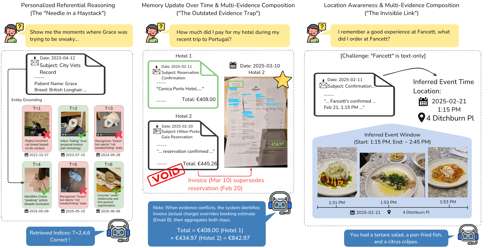

<a id="atm-bench-zh"></a>

<div align="center">

# ATM-Bench：长期个性化参照记忆问答

---

**首个针对多模态、多来源个性化参照记忆问答的基准，涵盖约 4 年的长时间跨度，支持基于证据的检索与回答。**

[🇬🇧 English](README.md) • [🇨🇳 中文](README_zh.md)

[](https://arxiv.org/abs/2603.01990)
[](https://atmbench.github.io/)
[](https://atmbench.github.io/leaderboard.html)
[](https://huggingface.co/datasets/Jingbiao/ATM-Bench)
[](LICENSE)

[🚀 快速开始](#quick-start-zh) • [🤖 智能体结果](#general-purpose-agent-results-zh) • [🧠 记忆系统](#memory-system-baseline-results-zh) • [📊 Oracle / NIAH](#oracle-and-niah-results-zh) • [🏆 在线榜单](https://atmbench.github.io/leaderboard.html) • [📖 引用](#citation-zh)

</div>

<video src="https://atmbench.github.io/static/videos/ATM-Bench-demo.mp4" controls width="100%"></video>

> 📄 **论文：** [According to Me: Long-Term Personalized Referential Memory QA](https://arxiv.org/abs/2603.01990)  
> 🌐 **项目主页：** [https://atmbench.github.io/](https://atmbench.github.io/)  
> 🏆 **在线榜单：** [https://atmbench.github.io/leaderboard.html](https://atmbench.github.io/leaderboard.html)

<a id="table-of-contents-zh"></a>
## 目录

- [ATM-Bench：长期个性化参照记忆问答](#atm-bench-zh)
  - [目录](#table-of-contents-zh)
  - [时间线](#timeline-zh)
  - [通用智能体结果](#general-purpose-agent-results-zh)
  - [记忆系统基线结果](#memory-system-baseline-results-zh)
  - [Oracle 与 NIAH 结果](#oracle-and-niah-results-zh)
  - [概述](#overview-zh)
  - [记忆摄入](#memory-ingestion-zh)
  - [NIAH 评估设置](#niah-evaluation-setup-zh)
  - [快速开始](#quick-start-zh)
  - [仓库结构](#repository-structure-zh)
  - [文档](#documentation-zh)
  - [引用](#citation-zh)
  - [链接](#links-zh)
  - [许可证](#license-zh)

<a id="timeline-zh"></a>
## 时间线

- **2026-03-03：** arXiv 论文发布（[2603.01990](https://arxiv.org/abs/2603.01990)）
- **2026-03-04：** 初始代码发布，包含 MMRAG、Oracle、NIAH 基线实现，以及四个移植的第三方基线（A-Mem、HippoRAG2、mem0、MemoryOS）。
- **2026-03-12：** 首批通用智能体基准结果发布，涵盖 Claude Code、Codex 和 OpenCode。
- **2026-03-12：** ATM-Bench 数据集在 Hugging Face 发布（[Jingbiao/ATM-Bench](https://huggingface.co/datasets/Jingbiao/ATM-Bench)）。
- **2026-03-13：** 修复 Opencode Token 统计并更新 OpenClaw 结果。
- **2026-05-15：** 发布 MemPalace 移植版本，并加入记忆系统对比结果。
- **2026-05-27：** 发布 SimpleMem 移植版本，并加入记忆系统对比结果。
- **2026-05-28：** 发布 Pi 智能体基准结果。
- **即将推出：** 通用智能体基准支持，包括 OpenClaw。

<a id="general-purpose-agent-results-zh"></a>
## 通用智能体结果

> 🏆 **最新结果请查看 [ATM-Bench 在线榜单](https://atmbench.github.io/leaderboard.html)。** 下方静态表格可能落后于最新提交。

ATM-Bench-Hard 上的初始通用智能体结果如下。QS 分数使用 `gpt-5-mini` 作为主要评判模型。`Tokens/QS` 表示每 1 个 QS 百分点对应的 token 成本，因此数值越低表示效率越高。

| 智能体 | 模型 | QS (Acc.) ↑ | 总 Token 数 ↓ | Tokens/QS ↓ |
|--------|------|-------------:|---------------:|------------:|
| Claude Code | Claude Opus 4.6 | 33.80% | 4.93M | 0.146M |
| Claude Code | Claude Opus 4.7 | 39.50% | 5.03M | 0.127M |
| Codex | GPT-5.2 | 39.70% | 15.46M | 0.389M |
| Codex | GPT-5.2 (w/o SGM) | 16.30% | 22.23M | 1.364M |
| Codex | GPT-5.5 | 41.40% | 16.14M | 0.390M |
| OpenCode | GLM-5 | 27.00% | 16.89M | 0.626M |
| OpenCode | Qwen3.5-397B-A17B | 24.50% | 12.06M | 0.492M |
| OpenCode | Kimi K2.5 | 30.30% | 8.46M | 0.279M |
| OpenCode | Kimi K2.5 (w/o SGM) | 6.50% | 21.40M | 3.292M |
| OpenCode | MiniMax M2.5 | 22.90% | 14.5M | 0.633M |
| OpenCode | MiniMax M2.7 | 27.80% | 13.48M | 0.485M |
| OpenClaw 🦞 | Kimi K2.5 | 25.40% | 9.63M | 0.379M |
| Pi | GLM-5.1 | 38.80% | 8.17M | 0.211M |
| Pi | Kimi K2.5 | 37.80% | 9.92M | 0.262M |
| Pi | MiMo v2.5 | 36.10% | 18.23M | 0.505M |

* 所有编程智能体均使用其默认配置（包括默认的 reasoning effort）。

编程智能体在 ATM-Bench-Hard 上仍然表现不佳，但显著优于各种智能体记忆基线。

<a id="memory-system-baseline-results-zh"></a>
## 记忆系统基线结果

下面的记忆系统基线使用 `Qwen3-VL-8B-Instruct-FP8` 作为回答模型，`Qwen3-VL-2B-Instruct` 作为共享的图像/视频描述预处理器。ATM-Bench-Hard 使用 `atm-bench-hard` 发布集合，结果可能与原始预印本不同。

| 系统 | 索引时间 (hr) ↓ | ATM-Bench QS ↑ | ATM-Bench Recall@10 ↑ | ATM-Bench-Hard QS ↑ | ATM-Bench-Hard Recall@10 ↑ |
|------|----------------:|---------------:|----------------------:|--------------------:|---------------------------:|
| [A-Mem](https://github.com/WujiangXu/A-mem) | 12.6 | 44.8 | 66.4 | 9.9 | 31.7 |
| [mem0](https://github.com/mem0ai/mem0) | 16.7 | 43.5 | 61.9 | 9.2 | 23.7 |
| [MemoryOS](https://github.com/BAI-LAB/MemoryOS) | 36.6 | 47.2 | 59.2 | 13.7 | 32.7 |
| [HippoRAG2](https://github.com/OSU-NLP-Group/HippoRAG) | 1.5 | 42.9 | 66.4 | 9.4 | 31.9 |
| [MemPalace](https://github.com/MemPalace/mempalace) | 0.5 | 56.8 | 76.4 | 9.7 | 28.3 |
| [SimpleMem](https://github.com/aiming-lab/SimpleMem) | 15.7 | 27.3 | 23.3 | 3.2 | 7.0 |

<a id="oracle-and-niah-results-zh"></a>
## Oracle 与 NIAH 结果

### ATM-Bench-Hard 上的 Oracle 结果

QS 使用 `gpt-5-mini` 作为主要评判模型。

| 模型 | 设置 | QS |
|------|------|----|
| GPT-5 | Raw | 72.12% |
| Qwen3-VL-8B-Instruct | Raw | 40.14% |
| Qwen3-VL-8B-Instruct | SGM | 27.98% |
| Qwen3-VL-8B-Instruct | D | 21.69% |

### ATM-Bench-Hard 上的 NIAH 结果

对于 NIAH，我们比较了 `Qwen3-VL-8B-Instruct` 在不同 haystack 规模下的 SGM 和 Raw 设置。

| 模型 | 设置 | QS | 平均上下文 Token 数 |
|------|------|----|---------------------|
| Qwen3-VL-8B-Instruct | Raw, Oracle | 40.14% | 5.7k |
| Qwen3-VL-8B-Instruct | Raw, NIAH-25 | 25.43% | 15.9k |
| Qwen3-VL-8B-Instruct | Raw, NIAH-50 | 24.87% | 29.0k |
| Qwen3-VL-8B-Instruct | Raw, NIAH-100 | 10.90% | 56.0k |
| Qwen3-VL-8B-Instruct | SGM, Oracle | 27.98% | 4.6k |
| Qwen3-VL-8B-Instruct | SGM, NIAH-25 | 16.33% | 12.5k |
| Qwen3-VL-8B-Instruct | SGM, NIAH-50 | 15.77% | 23.9k |
| Qwen3-VL-8B-Instruct | SGM, NIAH-100 | 12.66% | 45.8k |

<a id="overview-zh"></a>
## 概述

现有的长期记忆基准主要关注对话历史，无法捕捉基于真实生活经验的个性化参照。ATM-Bench 通过以下特性填补了这一空白：

- **多模态与多来源数据：** 图像、视频、邮件
- **长时间跨度：** 约 4 年的个人记忆
- **参照性查询：** 解析个性化参照（如"展示 Grace 试图偷偷摸摸的那些瞬间……"）
- **基于证据：** 人工标注的问答对，配有真实记忆证据
- **多证据推理：** 需要来自多个来源的证据的查询
- **冲突证据：** 处理矛盾信息



<a id="memory-ingestion-zh"></a>
## 记忆摄入

**记忆摄入**分为两个步骤：

1. **记忆预处理**（每条记忆项的表示方式）
2. **记忆组织**（记忆项的结构化/关联方式）

<p align="center">
  
</p>

### 记忆预处理

我们比较了两种预处理表示：

- **描述式记忆（DM）：** 每条记忆项用一段自然语言描述表示。
- **模式引导记忆（SGM）：** 每条记忆项用固定的文本键值字段和模式表示。

在 SGM 中，模式字段与模态相关。例如：

- **图像/视频记忆：** `time`、`location`、`entities`、`ocr`、`tags`
- **邮件记忆：** `time`、`summary`、`body`

DM 和 SGM 包含相同的底层信息，但使用不同的格式。

在本代码库中，DM 以描述/标题风格的文本实现，SGM 以基于模式的键值文本字段实现。

### 记忆组织

记忆存储的组织方式：

- **堆叠记忆：** 记忆项无显式关联地存储。
- **链接记忆：** 记忆项通过推断的关系链接（图结构）；智能体系统还可以在组织过程中更新现有记忆项。

<a id="niah-evaluation-setup-zh"></a>
## NIAH 评估设置

除了端到端的检索+生成评估外，我们还提供了 **NIAH（大海捞针）** 评估：

- 每个问题配有固定的证据池（`niah_evidence_ids`），包含所有真实记忆项。
- 池中其余部分由真实干扰项填充。
- 这将答案生成/推理质量与检索质量隔离开来。

参见：
- [`docs/niah.md`](docs/niah.md)

<a id="quick-start-zh"></a>
## 快速开始

### 下载数据集

ATM-Bench 托管在 Hugging Face [`Jingbiao/ATM-Bench`](https://huggingface.co/datasets/Jingbiao/ATM-Bench)。下载脚本会下载完整发布数据，并自动将文件放到评估脚本期望的位置。

**完整下载（约 3.3 GB）** — 包含 QA、NIAH 池、预处理记忆、emails、原始图像、原始视频以及 GPS 反向地理编码缓存：

```bash
bash scripts/download_data.sh
```

执行后将得到：

```
data/atm-bench/atm-bench.json
data/atm-bench/atm-bench-hard.json
data/atm-bench/niah/...
data/raw_memory/email/emails.json                   # emails
data/raw_memory/image/...                           # 原始图像
data/raw_memory/video/...                           # 原始视频
data/raw_memory/geocoding_cache/...                 # GPS 反向地理编码缓存
output/image/qwen3vl2b/batch_results.json           # 预处理的图像记忆
output/video/qwen3vl2b/batch_results.json           # 预处理的视频记忆
```

HF 上的 `data/processed_memory/{image,video}_batch_results.json` 会被脚本自动重命名并复制到 `output/image/qwen3vl2b/batch_results.json` 与 `output/video/qwen3vl2b/batch_results.json`。

脚本使用 `huggingface_hub` Python 包（若未安装会自动安装）。若数据集为私有，请先运行 `huggingface-cli login`。

### 安装

```bash
conda create -n atmbench python=3.11 -y
conda activate atmbench
pip install -r requirements.txt
pip install -e .
```

### API 密钥

通过环境变量设置：
```bash
export OPENAI_API_KEY="your-key"
export VLLM_API_KEY="your-key"
```

或使用本地密钥文件（已 gitignore）：
- `api_keys/.openai_key`
- `api_keys/.vllm_key`

### 准备记忆文件

运行这些基线之前，`output/{image,video}/qwen3vl2b/` 下必须存在 `batch_results.json`。有两种方式：

**方式 A（推荐）：直接从 Hugging Face 下载预处理记忆。**

若已运行上面的 `bash scripts/download_data.sh`，预处理的记忆文件已就位：

- `output/image/qwen3vl2b/batch_results.json`
- `output/video/qwen3vl2b/batch_results.json`

无需其他操作，可直接跳到下面的快速命令。

**方式 B：从原始图像/视频重新生成记忆文件。**

仅当你需要重新预处理（例如换用其他 VLM 或使用自己的原始记忆）时才需要。需要 `data/raw_memory/image/` 下的原始图像与 `data/raw_memory/video/` 下的视频：

```bash
# 可选但推荐：预加载反向地理编码缓存
# 缓存文件以媒体文件名为键，因此缓存包必须与当前图像/视频文件名匹配。
bash scripts/memory_processor/image/copy_gps_cache.sh output/image/qwen3vl2b/cache
bash scripts/memory_processor/video/copy_gps_cache.sh output/video/qwen3vl2b/cache

# 生成记忆项化结果
bash scripts/memory_processor/image/memory_itemize/run_qwen3vl2b.sh
bash scripts/memory_processor/video/memory_itemize/run_qwen3vl2b.sh
```

### 快速命令（MMRAG + Oracle）

```bash
# MMRAG（同时运行 ATM-bench 和 ATM-bench-hard）
#   需要：`bash scripts/download_data.sh`
#        + 本地运行的 vLLM 服务，地址 http://127.0.0.1:8000/v1/chat/completions，
#          模型 Qwen/Qwen3-VL-8B-Instruct-FP8（可通过 VLLM_ENDPOINT / ANSWERER_MODEL
#          环境变量覆盖）。
bash scripts/QA_Agent/MMRAG/run.sh

# Qwen3-VL-8B 原始图像/视频 Oracle（本地上界）
#   需要：`bash scripts/download_data.sh`
#        + 本地 vLLM 服务，模型 Qwen/Qwen3-VL-8B-Instruct-FP8。
bash scripts/QA_Agent/Oracle/run_oracle_qwen3vl8b_raw.sh

# GPT-5 原始图像/视频 Oracle（无需本地 GPU / vLLM）
#   需要：`bash scripts/download_data.sh`
#        + 环境变量 OPENAI_API_KEY 或文件 api_keys/.openai_key。
bash scripts/QA_Agent/Oracle/run_oracle_gpt5.sh
```

### 基线兼容性与环境

- 核心基线（`MMRAG`、`Oracle`、`NIAH`）在主 `atmbench` 环境中测试。
- 本仓库中的第三方记忆系统基线包括：
  - `A-Mem`
  - `HippoRAG2`
  - `mem0`
  - `MemoryOS`
  - `MemPalace`
  - `SimpleMem`
- 强烈建议在独立的 conda 环境中运行 `MemoryOS` 和 `MemPalace`。`MemoryOS` 使用 FAISS / sentence-transformers 依赖栈，`MemPalace` 使用 ChromaDB / ONNX 本地嵌入依赖栈；隔离环境可避免它们与核心基线环境及彼此之间发生依赖冲突。
- `A-Mem`、`HippoRAG2` 和 `mem0` 经测试与核心基线环境兼容，但为确保可复现性和依赖隔离，仍建议使用独立环境。
- `SimpleMem` 通过克隆的上游仓库（LanceDB + Tantivy FTS 依赖栈）运行；详见 [`memqa/qa_agent_baselines/SimpleMem/README.md`](memqa/qa_agent_baselines/SimpleMem/README.md)。固定的上游 commit 为 [`094027eca4c890dc9912be8cee1da04428de8076`](https://github.com/aiming-lab/SimpleMem/commit/094027eca4c890dc9912be8cee1da04428de8076)（由 `scripts/QA_Agent/SimpleMem/run.sh` 校验）。
- 这些基线的设置参考位于 `third_party/` 下：
  - `third_party/A-mem/`
  - `third_party/HippoRAG/`
  - `third_party/mem0/`
  - `third_party/MemoryOS/`
- `MemPalace` 以 PyPI 包形式发布（`mempalace==3.3.5`），通过 `memqa/qa_agent_baselines/Mempalace/requirements.txt` 安装；不需要放入 `third_party/`。
- `SimpleMem` **未**纳入 `third_party/`。请在 ATMBench 旁边克隆上游仓库到固定的 commit，并将 `SIMPLEMEM_DIR` 指向它（默认值为 `../SimpleMem`）：

  ```bash
  git clone https://github.com/aiming-lab/SimpleMem.git ../SimpleMem
  git -C ../SimpleMem checkout 094027eca4c890dc9912be8cee1da04428de8076
  pip install -r ../SimpleMem/requirements.txt
  pip install -r memqa/qa_agent_baselines/SimpleMem/requirements.txt
  ```
- OpenClaw 支持已在规划中；我们将很快发布所有通用智能体（Claude Code、Codex、OpenCode、OpenClaw）在 ATM-Bench 上的评估设置。

详细的设置、数据布局和可复现性设置，请参见：
- [`docs/README.md`](docs/README.md)
- [`docs/data.md`](docs/data.md)
- [`docs/reproducibility.md`](docs/reproducibility.md)
- [`docs/baseline.md`](docs/baseline.md)
- [`docs/niah.md`](docs/niah.md)

<a id="repository-structure-zh"></a>
## 仓库结构

```
ATMBench/
├── memqa/              # 核心记忆问答实现
├── scripts/            # 实验脚本
├── docs/               # 文档
├── data/               # 数据目录（用户提供）
├── third_party/        # 外部智能体记忆系统
└── output/             # 实验输出（已 gitignore）
```

<a id="documentation-zh"></a>
## 文档

- [`docs/README.md`](docs/README.md) - 入门指南
- [`docs/data.md`](docs/data.md) - 数据格式与准备
- [`docs/baseline.md`](docs/baseline.md) - 基线实现
- [`docs/niah.md`](docs/niah.md) - NIAH 协议与使用
- [`docs/metrics.md`](docs/metrics.md) - 评估指标
- [`docs/reproducibility.md`](docs/reproducibility.md) - 复现说明
- [`docs/repo_structure.md`](docs/repo_structure.md) - 仓库组织

<a id="citation-zh"></a>
## 引用

如果您在研究中使用了 ATM-Bench，请引用：

```bibtex
@article{mei2026atm,
  title={According to Me: Long-Term Personalized Referential Memory QA},
  author={Mei, Jingbiao and Chen, Jinghong and Yang, Guangyu and Hou, Xinyu and Li, Margaret and Byrne, Bill},
  journal={arXiv preprint arXiv:2603.01990},
  year={2026},
  url={https://arxiv.org/abs/2603.01990},
  doi={10.48550/arXiv.2603.01990}
}
```

<a id="links-zh"></a>
## 链接

- 📄 **论文：** https://arxiv.org/abs/2603.01990
- 🌐 **项目主页：** https://atmbench.github.io/
- 🏆 **在线榜单：** https://atmbench.github.io/leaderboard.html
- 🤗 **数据集：** https://huggingface.co/datasets/Jingbiao/ATM-Bench
- 💻 **代码：** https://github.com/JingbiaoMei/ATM-Bench
- 🐛 **问题反馈：** https://github.com/JingbiaoMei/ATM-Bench/issues

<a id="license-zh"></a>
## 许可证

本项目采用 MIT 许可证 - 详见 [LICENSE](LICENSE) 文件。
